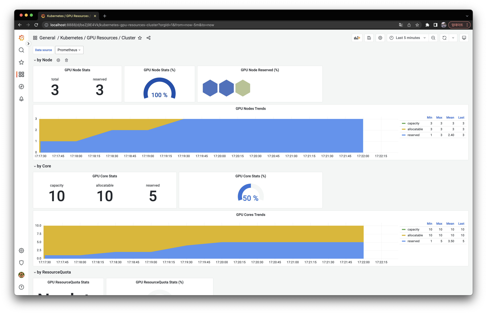

# Kube GPU Resource Cluster

Grafana dashboard for GPU resource.

This dashboard provide following things.

- by Node
  - GPU Node Stats
    - total
    - reserved
    - usage
  - GPU Node Stats (%)
    - reserved / total
    - usage
  - GPU Node Reserved (%)
  - GPU Nodes Trends
    - capacity
    - allocatable
    - reserved
    - usage
- by Core
  - GPU Core Stats
    - capacity
    - allocatable
    - reserved
    - usage
    - util
  - GPU Core Stats (%)
    - reserved / allocatable
    - usage / allocatable
    - util / allocatable
  - GPU Core Trends
    - capacity
    - allocatable
    - reserved
    - usage
    - util
- by ResourceQuota
  - GPU ResourceQuota Stats
    - hard
    - used
  - GPU ResourceQuota Stats (%)
    - used / hard
    - hard / allocatable
    - used / allocatable
  - GPU ResourceQuota Trends
    -  hard
    -  used
  -  GPU ResourceQuota Trends by Namespace
-  by Namespace
   -  GPU Cores Reserved By Namespace Trends
   -  GPU Cores Usage By Namespace Trends
   -  GPU Cores Util By Namespace Trends
-  by Pod
   -  GPU Cores Reserved By Pod Trends 
   -  GPU Cores Usage By Pod Trends
   -  GPU Cores Util By Pod Trends

## Preparation

You should deploy following exporter

- [dcgm-exporter](https://github.com/NVIDIA/dcgm-exporter)
  - I recommend you to install this chart through [gpu-operator](https://github.com/NVIDIA/gpu-operator), if you are first time to set GPU envioronment in kubernetes.

You should install following plugins

- [Hexmap](https://grafana.com/grafana/plugins/marcusolsson-hexmap-panel/)

## Install

Import [data.json](./data.json) to your Grafana dashboard.
